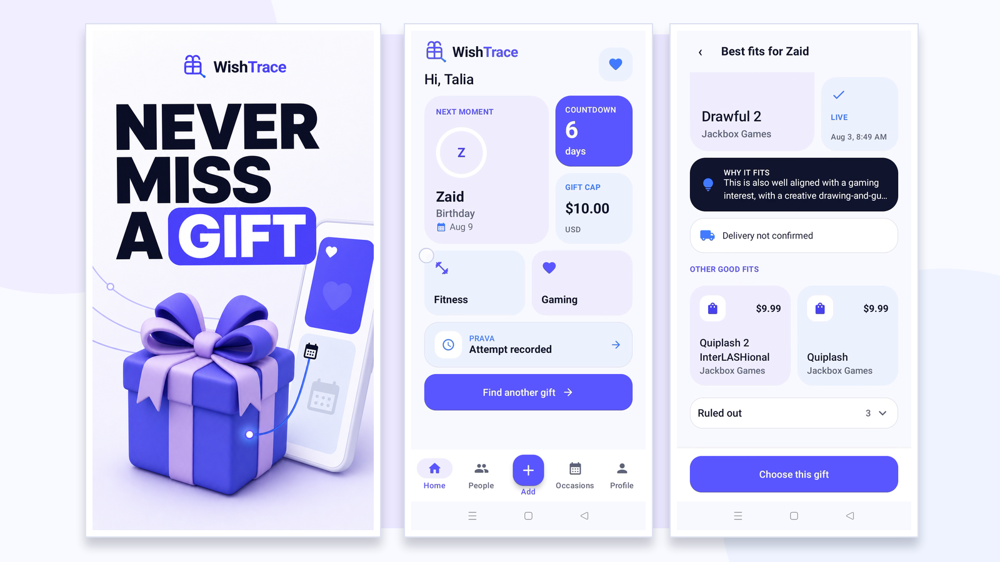
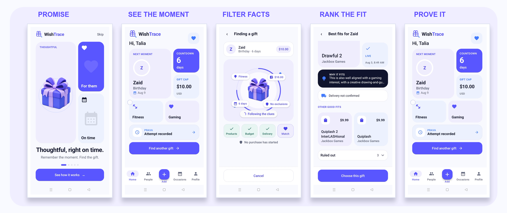
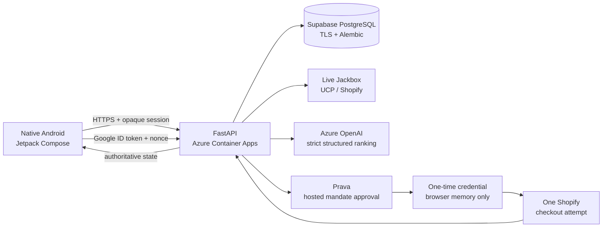

# WishTrace

<p align="center">
  <a href="https://youtu.be/HBruUzRImzo">
    
  </a>
</p>

<p align="center"><strong>Remember the moment. Find the gift. Complete it safely.</strong></p>

<p align="center">
  
  
  
  
  
</p>

WishTrace is a native Android gifting agent for the awkward gap between remembering someone's
birthday and actually sending something thoughtful. It remembers the person, occasion, interests,
exclusions and budget; retrieves live merchant products; rejects unsafe or unsuitable options in
code; asks Azure OpenAI to rank only the surviving product IDs; and turns the reviewed choice into
one bounded Prava transaction.

**Prava Agentic Commerce Hackathon targets:** Overall / Prava, Visa Intelligent Commerce, Best UX,
OpenAI, and Localhost Most Startup-Ready Product.

## Watch it or try it

<p align="center">
  <a href="https://youtu.be/HBruUzRImzo">
    
  </a>
  <a href="https://youtube.com/shorts/PLitsDX9CzU?si=WN2m3a3jnwn-wMfw">
    
  </a>
  <a href="https://appetize.io/app/b_rnf2ki2tplx3ehubgeeb7lni2q">
    
  </a>
</p>

- **Launch showcase:** a polished 60-second overview of the problem, product loop and user value.
- **End-to-end walkthrough:** a physical-phone run from recipient context to live product ranking, Prava approval,
  one real Shopify payment attempt, and truthful reconciliation.
- **Interactive build:** the submitted native Android APK running in Appetize.

The end-to-end walkthrough is the authoritative payment proof because Google Credential Manager, Android passkeys and
Prava's hosted approval are device-bound interactions that may differ inside a browser emulator.

## The five-screen promise

<p align="center">
  
</p>

1. **Know them** — save a recipient, relationship, local occasion date, interests, exclusions and a
   hard budget.
2. **See the moment** — Home makes the next person, countdown and spending cap understandable in
   seconds.
3. **Filter facts** — live candidates are checked for supported checkout, availability, variant,
   currency and budget before AI is involved.
4. **Rank the fit** — Azure OpenAI returns one selected candidate ID, up to two alternatives,
   evidence references and uncertainty through a strict schema.
5. **Prove the result** — the reviewed purchase becomes one Prava mandate and one merchant attempt;
   the app reconciles the exact outcome instead of turning ambiguity into success.

## Why this is not a model wrapper

> The model does not browse freely, invent a product, change a price, approve money, see card
> credentials or decide whether a hard rule can be ignored.

The distinctive part of WishTrace is the boundary between **subjective fit** and **objective
commerce**:

| Decision | Owner |
| --- | --- |
| What products, variants, prices and availability exist? | Live merchant adapter |
| Which options violate checkout, stock, variant or budget rules? | Deterministic constraint engine |
| Which eligible option best fits this particular person? | Azure OpenAI structured ranking |
| What exact merchant and amount may be charged? | User review + bounded Prava mandate |
| Did payment or merchant checkout actually complete? | Immutable backend ledger + provider reconciliation |

Azure OpenAI receives a closed package of eligible candidate IDs and opaque evidence references.
The response must match a versioned JSON schema, every returned ID is validated, unsupported
commerce language is rejected, and malformed output receives one repair attempt before a
deterministic fallback or explicit user choice.

That makes the model useful without making it authoritative. The product's durable wedge is a
private relationship-and-occasion memory that can repeatedly become an explainable, auditable
action—not another shopping chatbot that stops at suggestions.

## Architecture



The Android client owns presentation, navigation, local form state and hosted-flow handoff. The
backend owns every secret, Google token validation, persistence, candidate normalization,
deterministic filtering, OpenAI orchestration, Prava idempotency, browser execution and transaction
reconciliation.

### Backend controls

- One-time auth challenges with nonce validation and replay protection.
- Hashed opaque bearer sessions with expiry, logout and per-user ownership checks.
- Integer minor-unit money and explicit ISO currencies.
- Immutable discovery snapshots, ranking decisions, mandate charges and transaction transitions.
- Idempotency on approval, charge, merchant checkout and provider reporting.
- Fail-closed `UNKNOWN` handling when the merchant or provider result is not authoritative.
- No OpenAI, Prava, database or browser-automation secret in the APK.

## Track proof

| Target | What WishTrace demonstrates |
| --- | --- |
| **Overall / Prava** | A real discover → decide → approve → execute → reconcile loop, not a landing page or mocked checkout. |
| **Visa Intelligent Commerce** | Explicit consent, a fixed merchant and cap, one-time credentials, duplicate-action protection and an authoritative result. Payment credentials never enter Android or the model. |
| **Best UX** | A scan-first bento interface, one clear action per screen, visible filtering logic, exact money language, and honest cancellation, decline, expiry and unknown recovery. |
| **OpenAI** | `gpt-5.6-terra` ranks only code-approved live IDs through strict structured output. Evidence-linked preference judgment is isolated from product facts and payment authority. |
| **Localhost Most Startup-Ready** | A repeat-use relationship memory, not a one-off recommendation. The wedge can grow into trusted occasion planning and merchant revenue without requiring recipient adoption. |

## Sandbox proof, precisely

The demonstrated path uses the official Jackbox Shopify store and Prava sandbox:

```text
live product candidates
→ deterministic eligibility checks
→ validated Azure OpenAI ranking
→ exact gift and amount review
→ owner-approved Prava mandate
→ one-time payment credential
→ one real Shopify Pay attempt
→ expected sandbox processor decline
→ DECLINED reported to Prava
→ “Attempt recorded” in WishTrace
```

**Live and verified:** Google authentication on a Play-enabled phone, Supabase persistence, live
Jackbox catalog/cart facts, Azure OpenAI ranking, Prava mandate approval, credential minting, one
merchant submission, provider reporting and app reconciliation.

**Sandbox boundary:** the credential is a Prava sandbox credential and the merchant decline is the
organizer-expected terminal result.

**Not claimed:** production money movement, a completed merchant order, gift delivery, or general
stored-value support. WishTrace never labels the sandbox decline as “purchased” or “gift secured.”

## Tech stack

| Layer | Technology |
| --- | --- |
| Mobile | Kotlin, Jetpack Compose, Material 3, Navigation Compose, Coroutines and Flow |
| Identity | Android Credential Manager + backend Google ID-token verification |
| API | Python 3.12, FastAPI, Pydantic v2, HTTPX |
| Data | Supabase PostgreSQL, SQLAlchemy async, psycopg 3, Alembic, TLS |
| Commerce | UCP 2026-04-08, Jackbox Shopify catalog/cart/checkout |
| Intelligence | Azure AI Foundry, OpenAI Responses API, strict dynamic JSON Schema |
| Payments | Prava hosted mandates, single-use credentials, explicit result reporting |
| Execution | Playwright browser actor with one-attempt and allowlist boundaries |
| Deployment | Azure Container Apps + Azure Container Registry |

## How OpenAI and Codex were used

**Azure OpenAI** powers the runtime preference decision. The backend supplies only still-eligible
live candidate IDs and relevant evidence tokens, uses `store=false`, validates the structured
response, and persists one immutable decision for recovery and audit. Commerce facts and payment
authority remain outside the model.

**Codex** was the engineering partner across the native Android app, FastAPI service, merchant
normalization, deterministic constraints, Prava state machine, browser proof, tests, deployment
debugging and evidence review. The repository-local skills and decision records preserve the
truth boundary instead of relying on chat history.

## Run locally

Requirements:

- Python 3.12 and [uv](https://docs.astral.sh/uv/)
- JDK 17
- Android SDK 36
- An Android API 23+ emulator or phone
- Your own Google, Azure OpenAI, Supabase and Prava sandbox configuration

Create the ignored root `.env` from [`templates/.env.example`](templates/.env.example), then:

```powershell
cd backend
uv sync --all-groups
uv run alembic upgrade head
uv run python -m scripts.run_server
```

Build and verify Android:

```powershell
cd android
.\gradlew.bat :app:assembleDebug
.\gradlew.bat :app:testDebugUnitTest
.\gradlew.bat :app:lintDebug
```

The checked-in Android configuration targets the deployed public backend. Override
`WISHTRACE_API_BASE_URL` as a Gradle property when running against a local service.

## Verification

```powershell
cd backend
uv run python -m pytest
uv run ruff check app tests migrations scripts
uv run mypy app scripts
uv run alembic check
```

The final evidence gate includes backend tests and static analysis, Android unit tests, debug
assembly and lint, a Supabase TLS/schema check, public health verification, and physical-device
OAuth and payment-return testing.

## Repository guide

- [Product and scope](PLAN.md)
- [Architecture](docs/ARCHITECTURE.md)
- [OpenAI boundary](docs/OPENAI_ORCHESTRATION.md)
- [Prava integration](docs/PRAVA_INTEGRATION.md)
- [Merchant validation](docs/MERCHANT_VALIDATION.md)
- [Track strategy](docs/TRACK_STRATEGY.md)
- [Integration evidence](docs/INTEGRATION_STATUS.md)
- [Pre-existing work disclosure](docs/PREEXISTING_WORK.md)

WishTrace was built for the Prava Agentic Commerce Hackathon. Runtime routes do not replace an
unavailable integration with invented products, simulated payment success or fake receipts.
